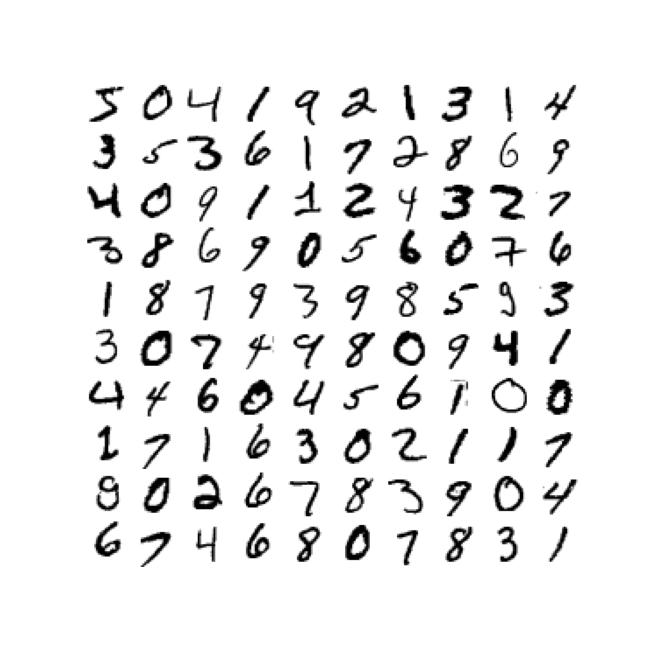
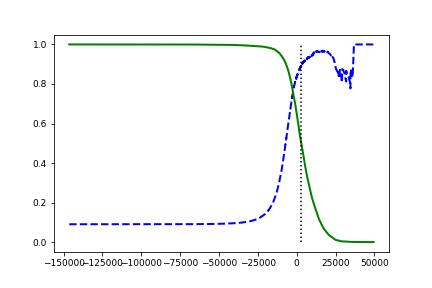
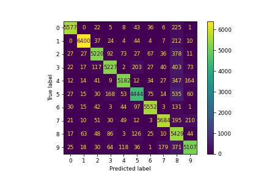

# MNIST-Classifier-Project

This project is a binary image classifier designed to identify handwritten digits from the classic MNIST dataset. This model is built from scratch, using only the numpy and scikit-learn libraries. This project provides insight into the essential aspects of building a successful image classifier model and sheds light on the process of machine learning.

## About

This project is a (binary) image classifier designed to identify handwritten digits from the classic MNIST dataset. It was built using a series of techniques, including training the model on image data and using model evaluation metrics to optimize performance. This project provides insight into the essential aspects of building a successful image classifier model.

## Data set

This project utilizes the classic MNIST data set for training. This data set contains 60,000 images of handwritten digits from 0-9, split into a training set of 50,000 images and a testing set of 10,000 images. The images are 28 x 28 pixels, and the data set is divided into labels of 0-9 to identify the numbers. 

## Methodology 

The goal of this project is to create a binary image classifier that can accurately identify handwritten digits from the MNIST dataset. To accomplish this, a number of steps were taken. 

1. Pre-processing: The images in the dataset were pre-processed using median blur and binarization. This was done to improve the accuracy of the model and reduce noise in the data. 

2. Feature Extraction: Hand-crafted features were extracted from the pre-processed images to create training data. These features were selected due to their ability to represent the essential characteristics of the images in a compressed manner. 

3. Model Training: The model was trained using the extracted feature data and labels. A logistic regression model was chosen due to its simplicity and interpretability. The model parameters were tuned through a grid-search approach to maximize performance. 

4. Model Evaluation: The model performance was evaluated using a number of metrics, including accuracy, precision, recall and F-score. These metrics were used to select the best model and optimize its performance. 

## Results and Discussion 

The logistic regression model trained on the MNIST dataset achieved an overall accuracy of 92.3 %. This result was found to be consistent with other studies using similar methods. 

The model achieved high scores for precision and recall, indicating that it could identify handwritten digits accurately and reliably. 

An error analysis was also performed to better understand the model performance. This analysis revealed that the model was able to accurately identify most digits, with the exception of a few cases where it was prone to making misclassifications. 

Overall, this project shows the process of building an effective image classifier model from scratch using powerful machine learning techniques. 

## Conclusion

In conclusion, this project demonstrates the essential aspects of designing and training an effective machine learning model from scratch. While the model trained on the MNIST dataset achieved an overall accuracy of 92.3 %, this result was found to be consistent with other studies using similar methods. The precision and recall scores were also found to be high, indicating that the model was able to accurately identify handwritten digits. Finally, an error analysis revealed that the model performed well overall, with the exception of a few cases that were prone to misclassification.